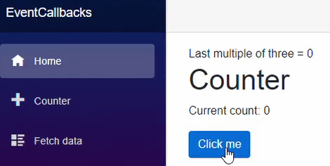
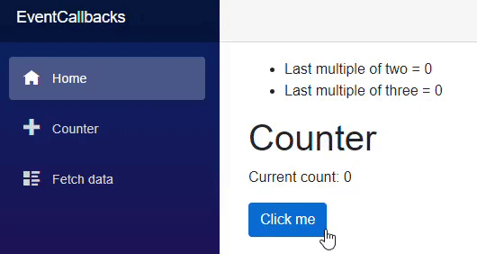

[](https://github.com/mrpmorris/blazor-university/tree/master/src/Components/EventCallbacks)

The `EventCallback<T>` class is a special Blazor class that can be exposed as a Parameter 
so that components can easily notify consumers when something of interest has occurred.

Once a public property of type `EventCallback<T>` has been declared and decorated with the `[Parameter]` attribute,
consuming components can specify in Razor mark-up which method to call when the event is triggered.

## Adding an event to the Counter component

In a new Blazor app, edit the **/Pages/Counter.razor** file and add a new callback parameter.

[Parameter]
`public EventCallback<int> OnMultipleOfThree { get; set; }`

This declares a new `EventCallback` named OnMultipleOfThree that any consuming component can register an interest in.
The `<int>` specifies that the value emitted by the event callback will be a `System.Int32`.

Now if we edit the **IncrementCount** method we can emit this event
whenever the counter is incremented to a multiple of 3.

```razor
private async Task IncrementCount()
{
  currentCount++;
  if (currentCount % 3 == 0)
    await OnMultipleOfThree.InvokeAsync(currentCount);
}
```

## Subscribing to EventCallback<T>

Edit the **/Pages/Index.razor** page so that we embed the Counter component and subscribe to its **OnMultipleOfThree** event.
Change its mark-up to the following.

```razor {: .line-numbers}
@page "/"

Last multiple of three = @LastMultipleOfThree

<Counter OnMultipleOfThree=@UpdateLastMultipleOfThreeValue/>

@code
{
  int LastMultipleOfThree = 0;

  private void UpdateLastMultipleOfThreeValue(int value)
  {
      LastMultipleOfThree = value;
  }
}
```

- **Line 9**  
    Declares a class member of type `int` that stores the last multiple of 3 value.
- **Line 3**  
    Displays the value of LastMultipleOfThree
- **Line 5**  
    Embeds the **Counter** component and sets its OnMultipleOfThree event to execute the **UpdateLastMultipleOfThreeValue** method when the event is emitted.
- **Line 11**  
    The value received from the event is used to update the value of **LastMultipleOfThree**.



## Differences between EventCallback<T> and .NET events

### Single-cast vs. Multi-cast

The most notable difference is that `EventCallback<T>` is a single-cast event handler, whereas .NET events are multi-cast.
Blazor `EventCallback<T>` is meant to be assigned a single value and can only call back a single method.

```razor
// Setting a Blazor EventCallback
<MyComponent SomeEvent=@MyMethodToCall/>

// Setting a .NET event
MyComponent.SomeEvent += MyMethodToCall;
// Unscrubscribing from the event
MyComponent.SomeEvent -= MyMethodToCall;
```

### Class vs. Struct

.NET events (delegates) are classes, whereas Blazor `EventCallback<T>` is a `readonly struct`.
Unlike .NET delegates, `EventCallback<T>` cannot be `null` and
therefore there is no need to do any null checking when emitting the event.

```razor
// Invoking a .NET event
MyNetEvent?.Invoke(this, someValue);

// Invoking a CallbackEvent<T>
MyEventCallback.InvokeAsync(someValue);
```

### Awaitable callbacks

Standard .NET events are synchronous, whereas Blazor `EventCallback<T>` is asynchronous.
As we can see in the previous example code, `EventCallback<T>.InvokeAsync` returns a `Task` that can be awaited.

### Razor mark-up compatibility

It is not possible to decorate a standard .NET event with `[Parameter]` and
have it settable via Razor mark-up, whereas with `EventCallback<T>` it is.
This gives us the ability to express event callbacks in the view mark-up itself,
which makes the developer's intentions easier to see.

### Automatic state change detection

Whenever a method is called from an `EventCallback<T>`, after the method has executed Blazor will execute `StateHasChanged()`
on the consuming component so it can be re-rendered in case the method called altered state.
This is not something that will happen if the consumer's method was called back via a standard .NET event, `Action<T>`,
or any other approach not initiated by `EventCallback<T>`.

For example, if we add a new `[Parameter]` to the **Counter** component of type `Action<int>` and
call it whenever the current count is a multiple of two, we can see how the consuming component's render behavior is affected.

Change the **Counter** component to match the following code:

```razor {: .line-numbers}
@page "/counter"

<h1>Counter</h1>

<p>Current count: @currentCount</p>

<button class="btn btn-primary" @onclick=IncrementCount>Click me</button>

@code {
  private int currentCount = 0;

  [Parameter]
  public Action<int> OnMultipleOfTwoAction { get; set; }

  [Parameter]
  public EventCallback<int> OnMultipleOfThree { get; set; }

  private async Task IncrementCount()
  {
    currentCount++;
    if (currentCount % 2 == 0)
      OnMultipleOfTwoAction?.Invoke(currentCount);

    if (currentCount % 3 == 0)
      await OnMultipleOfThree.InvokeAsync(currentCount);
  }
}
```

- **Line 13**  
    A `[Parameter]` is added of type `Action<int>`
- **Lines 21-22**  
    If the current count is a multiple of two, then invoke **OnMultipleOfTwoAction**

Now alter the **Index** component so that it sets a method to callback whenever the value is a multiple of two,
and so it also stores and displays the last number received from **OnMultipleOfTwoAction** on the consumed component.

```razor {: .line-numbers}
@page "/"

<ul>
  <li>Last multiple of two = @LastMultipleOfTwo</li>
  <li>Last multiple of three = @LastMultipleOfThree</li>
</ul>

<Counter OnMultipleOfThree=@UpdateLastMultipleOfThreeValue OnMultipleOfTwoAction=@UpdateLastMultipleOfTwoValue />

@code
{
  int LastMultipleOfTwo = 0;
  int LastMultipleOfThree = 0;

  private Task UpdateLastMultipleOfThreeValue(int value)
  {
    LastMultipleOfThree = value;
    return Task.CompletedTask;
  }

  private void UpdateLastMultipleOfTwoValue(int value)
  {
    LastMultipleOfTwo = value;
  }
}
```

- **Line 13**  
    Defines a new member to store the most recent "multiple of two" value passed from the consumed component
- **Line 4**  
    Displays the value of **LastMultipleOfTwo** in the user interface
- **Line 9**  
    Sets OnMultipleOfTwo on the consumed component so that our component is notified whenever the current value is a multiple of two
- **Line 24**  
    Records the last multiple of two that the consumed component has notified us of

When we run the application now and click the button a number of times,
we'll see that when **UpdateLastMultipleOfTwoValue** is called back via `Action<int>` there is no update to the view,
but when **UpdateLastMultipleOfThreeValue** is called back via `EventCallback<int>` on the next click the view us updated
and the latest value of both are displayed.



#### Sequence of events

<table>
  <tbody>
    <tr>
      <td><strong>Click count</strong></td>
      <td><strong>Callback executed</strong></td>
      <td><strong>Consumer re-rendered</strong></td>
    </tr>
    <tr>
      <td>1</td>
      <td><em>None</em></td>
      <td><em>N/A</em></td>
    </tr>
    <tr>
      <td>2</td>
      <td><code>Action&lt;int&gt;</code></td>
      <td>No</td>
    </tr>
    <tr>
      <td>3</td>
      <td>
        <code>Action&lt;int&gt;</code><br /><code
          >EventCallback&lt;int&gt;</code
        >
      </td>
      <td>Yes</td>
    </tr>
    <tr>
      <td>4</td>
      <td><code>Action&lt;int&gt;</code></td>
      <td>No</td>
    </tr>
    <tr>
      <td>5</td>
      <td><em>None</em></td>
      <td><em>N/A</em></td>
    </tr>
    <tr>
      <td>6</td>
      <td>
        <code>Action&lt;int&gt;</code><br /><code
          >EventCallback&lt;int&gt;</code
        >
      </td>
      <td>Yes</td>
    </tr>
  </tbody>
</table>

## Callee method signatures

`EventCallback<T>` typically calls back a method with the signature `private Task SomeName(T value)` -
where the exposure level of the method is unimportant.
However, Blazor will allow us to set an `EventCallback<T>` to call back methods with a couple of variations.

If our method does not perform any asynchronous operations, then the following implementation may start to become tedious:

```razor
public Task SomethingHappenedInChildComponent(string value)
{
  // Do something with value
  return Task.CompletedTask;
}

Because of this, Blazor will allow us to set `EventCallback<T>` to call back a method with a void return type.

public void SomethingHappenedInChildComponent(string value)
{
  // Do something with value
}

Sometimes we only want to know when an event occurs, and aren't interested in the value that was passed with it. Blazor will also call back a method that excludes the value parameter.

// Either
public void SomethingHappenedInChildComponent()
{
  // Do something that doesn't need the value
}

// Or
public Task SomethingHappenedInChildComponent()
{
  // Do some asynchronous work that doesn't need the value
  return SomeTask;
}
```
