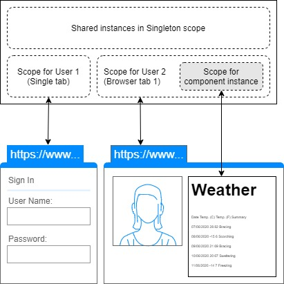
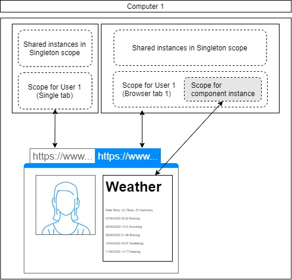

As mentioned in the section on [Singleton dependencies](https://blazor-university.com/dependency-injection/dependency-lifetimes-and-scopes/scoped-dependencies/),
a Singleton registered dependency must either have no state or should contain only state that may be shared across all
users on the same server.

And, as mentioned in the section on [Scoped dependencies](https://blazor-university.com/dependency-injection/component-scoped-dependencies/),
a Scoped registered dependency isolates an individual user's state away from everyone else
(or even the same user accessing the same website in a different browser tab).

But what about thread-safety?
When running a server-side application it is very likely that a Singleton registered dependency will be used
by more than one thread at a time.
Even if we register our dependency as Scoped, it is entirely possible that different components will be rendered by
different threads, this is described in detail in the section [Multi-threaded rendering](https://blazor-university.com/components/multi-threaded-rendering/).

Because of this, we must consider thread-safety when writing our services.
However, sometimes we do not own the source code for the services we consume, and they might not be thread-safe
(one example being EntityFrameworkCore's `DbContext` class).

## Demonstrating the problem

[](https://github.com/mrpmorris/blazor-university/tree/master/src/DependencyInjection/UsingGenericOwningComponentBase)

First, we'll modify the standard server-side Blazor project so the `WeatherForecastService` is no longer thread-safe.
We'll detect if more than one thread is using the service at the same time and throw an `InvalidOperationException`,
just as the `DbContext` class does.

We'll achieve this by keeping a thread-safe `Int32` field that we can increment as the method starts,
and decrement as the method finishes.
If the value is already `> 0` when we try to increment it then we can deduce that another thread is already executing the
method and then throw an exception.

After creating the project, edit the **/Data/WeatherForecastService.cs** file and add a new `volatile int` field:

private volatile int Locked;

At the beginning of the method we'll use [Interlocked.CompareExchange](https://docs.microsoft.com/en-us/dotnet/api/system.threading.interlocked.compareexchange)
framework method to ensure the `Locked` value is currently `0`, and then change it from `0` to `1`.
At the end of the method, we'll use Interlocked.Decrement to change the value of `Locked` back down to `0`.

We'll also need a delay in the method,
otherwise we have too little a chance of having two threads executing it at exactly the same time.
The `GetForecastAsyc` should be altered to the following code.

```razor {: .line-numbers}
public class WeatherForecastService
{
  private volatile int Locked;

  private static readonly string[] Summaries = new[]
  {
    "Freezing", "Bracing", "Chilly", "Cool", "Mild", "Warm", "Balmy", "Hot", "Sweltering", "Scorching"
  };

  public async Task<WeatherForecast[]> GetForecastAsync(DateTime startDate)
  {
    if (Interlocked.CompareExchange(ref Locked, 1, 0) > 0)
      throw new InvalidOperationException(
        "A second operation started on this context before a previous operation completed. Any "
        + "instance members are not guaranteed to be thread-safe.");

    try
    {
      await Task.Delay(3000);
      var rng = new Random();
      return Enumerable.Range(1, 5).Select(index => new WeatherForecast
      {
        Date = startDate.AddDays(index),
        TemperatureC = rng.Next(-20, 55),
        Summary = Summaries[rng.Next(Summaries.Length)]
      }).ToArray();
    }
    finally
    {
      Interlocked.Decrement(ref Locked);
    }
  }
}
```

- **Line 3**  
    A private volatile int field is added to keep track of the number of threads are currently executing the same method.
- **Line 12**  
    `Interlocked.CompareExchange` is used to set the `Locked` value to `1`, but only if it is currently `0`.
    The original value of `Locked` is returned from the method, if it is greater than `0` then we throw an `InvalidOperationException`.
- **Line 19**  
    We introduce an `await Task.Delay` of 3 seconds to simulate a long-running process.
    This will increase the risk of two threads clashing, and also ensure our code actually runs asynchronously.
    (See [Multi-threaded rendering](https://blazor-university.com/components/render-trees/multi-threaded-rendering/)).
- **Line 30**  
    Once the method is complete,
    decrement the `Locked` count from `1` back down to `0` so that another thread may execute the method without
    receiving an exception.

Now run the application, and attempt to open the **/fetchdata** page in two browser tabs at the same time,
and our \`InvalidOperationException\` should be thrown.

### Fix 1: Using a Scoped dependency

Changing the `WeatherForecastService` from a `Singleton` dependency to a `Scoped` one (in **Startup.cs**) will prevent
the thread reentrancy problem occurring across our users.

```razor
public void ConfigureServices(IServiceCollection services)
{
  services.AddRazorPages();
  services.AddServerSideBlazor();
  services.AddScoped<WeatherForecastService>();
}
```

Running the application again we'll see that we are able to open many tabs without causing a threading conflict.
If you've read the section on [Scoped dependencies](https://blazor-university.com/dependency-injection/dependency-lifetimes-and-scopes/scoped-dependencies/),
it will be obvious why.
Each tab receives its own unique instance of the `WeatherForecastService` and therefore only a single thread is using each
service at any one time.

However, we are only guaranteed our service will not be used by threads from other users of our application.
It does not guarantee our component will not be used by multiple threads at all.
The section on [Multi-threaded rendering](https://blazor-university.com/components/render-trees/multi-threaded-rendering/)
explains how server-side Blazor applications can utilize multiple threads to render the user interface.

Potentially having multiple threads rendering for a single user means we still have the possibility of thread reentrancy
on a service instance that is shared across multiple components.

If making the service thread-safe is not possible,
then one option in this scenario is to ensure that every component has its own unique instance of our service injected.

#### Demonstrating the problem with scoped dependencies

Create a new page named Conflict.Razor and give it the following simple mark-up.

```razor
@page "/conflict"

<FetchData />
<FetchData />
```

Having two occurrences of `FetchData` being rendered within our page will require two components to access the `WeatherForecastService`,
and because the `GetForecastAsync` method has an `await` in it.
This means the thread rendering the first `<FetchData/>` will be able to progress on to rendering the second `<FetchData/>`
before the first one has finished.

Run the application again and navigate to the **/conflict** page, and again we'll see our `InvalidOperationException` is
thrown again.

### Fix 2: Descending from OwningComponentBase<T>

Blazor has a generic component class named `OwningComponentBase<T>`.
When an instance of this class is created, it will first create its own `IServiceProvider` (used to resolve dependencies),
and will then use that service provider to create a new instance of `T` (which it then stores in a property named `Service`.

Because `OwningComponentBase<T>` owns its own unique `IServiceProvider` (hence the naming `**Owning**ComponentBase`),
this means the `T` resolved from the service provider will be unique to our component.

When our `OwningComponentBase<T>` component is disposed, its `IServiceProvider` (`Service` property) is disposed too,
which in turn will dispose of every instance it created - in this case, our `WeatherForecastService`.



OwningComponentBase<T> Server-side hosted



OwningComponentBase<T> Web Assembly hosted

Create a new component in **/Pages** named **OwnedFetchDataPage.razor** and enter the folloing mark-up.

```razor
@page "/owned-fetchdata"
<OwnedFetchData/>
<OwnedFetchData />
```

In the **/Shared** folder create a new component named **OwnedFetchData.razor** and copy over the mark-up
from the **FetchData.razor** file.

At the moment, the `OwnedFetchData` component has the same flaw,
it is injected with the same instance of `WeatherForecastService` that is shared with other components in the current
browser tab.
To fix this, follow these steps.

1. At the top of the page remove  
    `@inject WeatherForecastService ForecastService`
2. Replace the removed line with  
    `@inherits OwningComponentBase<WeatherForecastService>`
3. Remove the line of code  
    `forecasts = await ForecastService.GetForecastAsync(DateTime.Now);`
4. Replace it with  
    `forecasts = await Service.GetForecastAsync(DateTime.Now);`

Run the application again and navigate to the **/owned-fetchdata** page.
Because each instance of the `OwnedFetchData` component owns its own instance of `WeatherForecastService`,
they are able to interact with the service independently of each other, and without causing thread reentrancy problems.

If our server-side application were accessing a database,
we might descend our component from `OwningComponentBase<MyDbContext>` and fetch data from the database into an array for
rendering.
