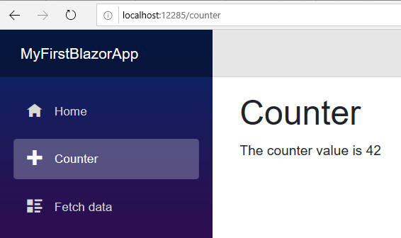

In Blazor, a page is a top-level view that can be reached via a URL.
In this exercise we'll recreate the `Counter.razor` page from scratch.

- In the Solution Explorer window, expand the `MyFirstBlazorApp.Client` project.
- Expand the `Pages` folder.
- Right-click `Counter.razor` and delete it.
- Right-click the `Pages` folder.
- Select **Add**\->**Razor Page** and create a new page named `Counter.razor`.
  If you receive a "scaffolding" error, you can instead select another file format and give it a `.razor` file extension.

A Razor page is a self-contained view.
We can include both the HTML and Razor view mark-up, and also any C# methods required for events etc.
Start your new razor page with the following.

```razor
@page "/counter"

<h1>Counter</h1>
<p>The counter value is @currentCount</p>

@code {
     private int currentCount= 42;
}
```

The first line identifies the URL required to render the content of this page.
More advanced routing techniques will be covered in the [Routing](http://blazor-university.com/routing/) section.

This is followed by some standard HTML, a H1 with a page title and a paragraph with some content.
Just as with a standard ASP.NET Razor page, it is possible to insert programmable content by escaping it with the `@` symbol.
In this case we are displaying the value of the `currentCount` private member.

Finally, the `@code` section of the page is declared.
This is where we write our properties / methods, event handlers, or whatever else we need.
Here is where our `currentCount` private member is declared and its initial value set.
Run the application, click the **Counter** link on the left of the page, and you should see something like the following:



## Interacting with the page

So far we've bound a private member of the page so that its value is output as HTML when the Razor view is rendered.
Next we'll update the value as a response to a user action.

Change the razor view to include the following Button mark-up.

<button class="btn btn-primary" @onclick=IncrementCounter>Increment counter</button>

This will add a HTML button and use some Bootstrap styles to make it look pretty.
It also sets its `onclick` event to execute a method named `IncrementCounter`.
The method implementation is very simple, and should be placed within the `@code` section.

```razor
@page "/counter"

<h1>Counter</h1>
<p>The counter value is @currentCount</p>
<button class="btn btn-primary" @onclick=IncrementCounter>Increment counter</button>

@code {
  private int currentCount = 42;

  private void IncrementCounter()
  {
    currentCount++;
  }
}
```

Now run the application again, navigate to the **Counter** page, and click the button to see the value on the page update.


